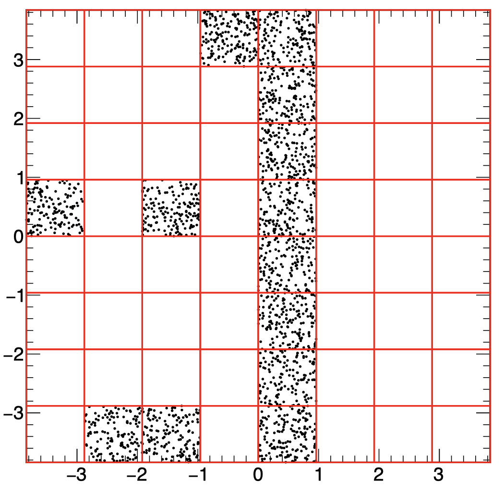
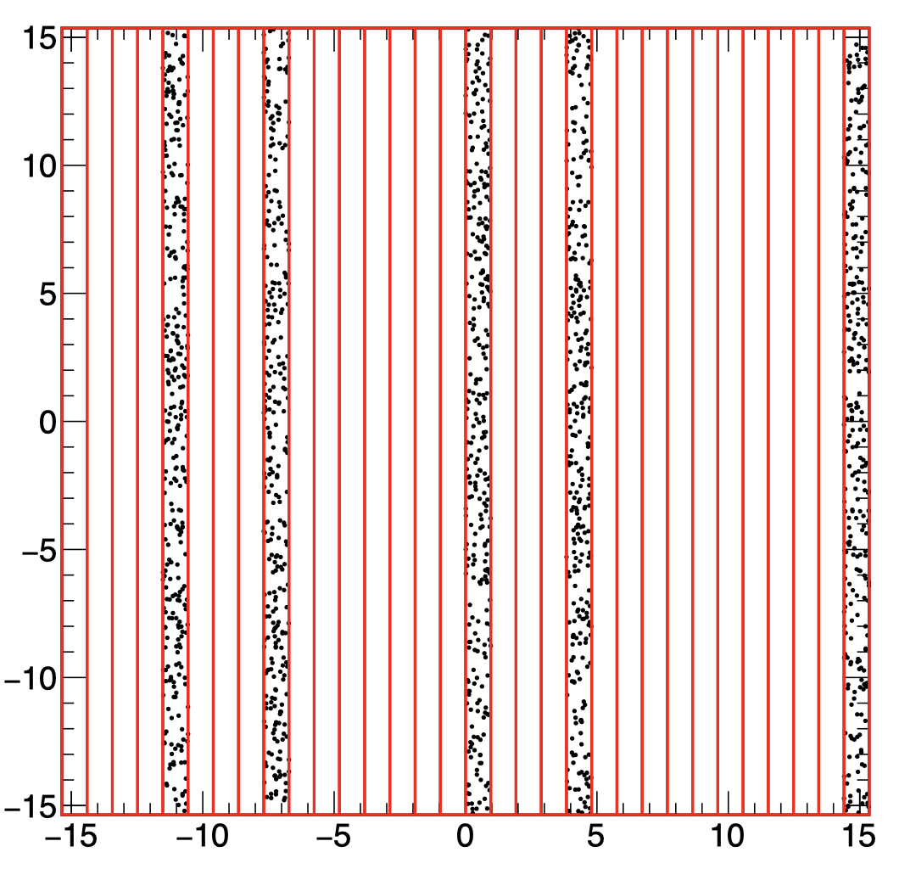
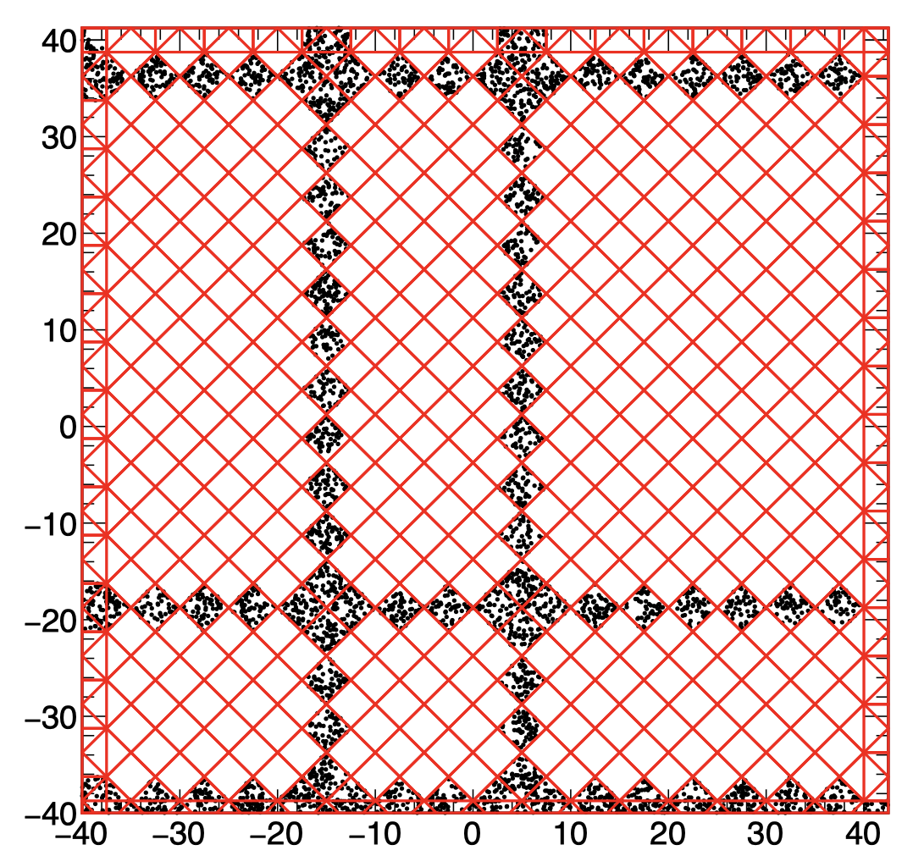

This project hosts few basic TRestDetectorReadout definitions that should serve as reference to new REST users.
A readout can be included inside a processing chain, and it serves to find the relation between the electronic channels of the detector and the physical readout channels, as well as to define the topology of the readout.
Typical processes that use the readout are `TRestDetectorHitsToSignalProcess` and `TRestDetectorSignalToHitsProcess` for event reconstruction.

Any REST process that includes a TRestDetectorReadout definition will be able to retrieve the readout by using:

```
fReadout = GetMetadata<TRestDetectorReadout>();
```

For a detailed description of the readout please refer to the [TRestDetectorReadout class documentation](https://sultan.unizar.es/rest/classTRestDetectorReadout.html).

A complex readout might require some calculation time to produce a mapping.
Therefore, a pre-produced readout in a ROOT file is recommended to be re-used later on at a processing chain.

#### List of readouts available in this project

* **pixelReadout**: It is found inside the file `pixelReadout.rml` and it defines a pixelated grid with a given number of `N_CHANNELS`. The size of the pixels is given by `PITCH` in mm which is the default units for distance inside REST.

* **pixelDecoding**: It is also found inside `pixelReadout.rml`. It defines a fixed 5x5 pixel grid with 5mm per pixel. It uses a decoding file, `dummy.dec`, to establish a relation between physical channels and electronics channel ids. 
It defines two readout planes that share the same decoding pattern with an offset.
The decoding file must contain the same number of channels as we find in our readout.

* **stripReadout**: It is found inside the file `strippedReadout.rml` defines two readout planes where we define stripped channels oriented in different axis depending on the readout plane.

#### Manually generating a readout file

To generate a readout and write it to file you may use the interactive ROOT shell loading the REST libraries through the command `restRoot` as follows:

```
restRoot
[0] TFile file("readouts.root", "RECREATE");
[1] TRestDetectorReadout readout("pixelReadout.rml");
[2] readout.Write("pixelReadout");
[3] file.Close();
```

#### Recovering the readout saved in a file

Now we will be able to recover the readout in a later session, and access the `TRestDetectorReadout` methods and metadata information.
The following code loads the saved readout and prints all the relevant information. 

```
restRoot
[0] TFile file("readouts.root");
[1] .ls
[2] TRestDetectorReadout* readout = file.Get<TRestDetectorReadout>("pixelReadout");
[3] readout->PrintMetadata();
```

The `PrintMetadata` method for `TRestDetectorReadout` might receive as argument an integer number to increase the level of detail in the information. For example:

```
[4] readout->PrintMetadata(3);
```

#### Visualizing the readout

Inside REST there is a macro, named `REST_ViewReadout`, to help visualize the readout topology.
Just load `restRoot` enabling official REST macros support using `--m 1` argument as in the following recipe:

```
restRootMacros
[0] REST_Detector_ViewReadout("readouts.root", "pixelReadout");
[1] REST_Detector_ViewReadout("readouts.root", "pixelDecoding", 1);
```

where the latest argument is an optional integer value specifying the readout plane to be visualized.

#### Accessing the readout methods to retrieve information

Once we generate a readout or recover it from a file, we will be able to access all the readout information from the instanced pointer.
A readout is built with nested structures that allow to define inner elements.
A readout is made of any number of readout planes (TRestDetectorReadoutPlane), that at the same time hosts any number of readout modules (TRestDetectorReadoutModule).
A readout module is composed of readout channels (TRestDetectorReadoutChannel) that are directly identified with a corresponding electronic channel.
In order to allow the description of arbitrary readout topologies, a readout channel is built with any number of squared (or triangular) pixels (TRestDetectorReadoutPixel) that are interconnected between them. 

If we assume the variable `readout` is an instance `TRestDetectorReadout*`, which points to our readout, we can access all those entities as follows:

```
[5] readout->GetNumberOfReadoutPlanes()
[6] readout->GetReadoutPlane(0)->GetNumberOfModules()
[7] readout->GetReadoutPlane(0)->GetModule(0)->GetNumberOfChannels()
[8] readout->GetReadoutPlane(0)->GetModule(0)->GetChannel(0)->Print();
```

Notice that if we do not add the usual `;` at the end of the line the value returned by the method will be printed on screen.

It is also possible to access methods that provide geometrical calculations, such as the distance from a hit to the corresponding readout plane which is useful to know the total drift distance.

```
[9] readout->GetReadoutPlane(1)->GetDistanceTo(12,15,10)
```

#### Translating positions into readout coordinates and vice-versa

The most important methods inside the `TRestDetectorReadout` class are those that allow us to translate a particular coordinate in our detector volume `(x,y)` into a readout plane, module, and channel, and vice-versa.
And identify the physical position (x,y) corresponding to a given electronic daq channel id.

```
Double_t GetX(Int_t planeID, Int_t modID, Int_t chID);
Double_t GetY(Int_t planeID, Int_t modID, Int_t chID);
Int_t GetHitsDaqChannel(TVector3 hitpos, Int_t& planeID, Int_t& moduleID, Int_t& channelID);
```

The `&` at the arguments inside the method definitions means that it is being passed by reference, and the variable given will be updated inside the method. Using our instance of the readout we can test those methods as follows:

```
[10] Int_t plane = -1;
[11] Int_t module = -1;
[12] Int_t channel = -1;

[13] Int_t daqId = readout->GetHitsDaqChannel(TVector3(5, 7, 12.5), plane, module, channel);

[14] cout << "The corresponding daqId is : " << daqId << " plane: " << plane << " module: " << module << " and channel: " << channel << endl;
[15] readout->GetX(plane, module, channel)
[16] readout->GetY(plane, module, channel)
```

After running those commands we should recover back the original position used to get the `daqId` with the drawback that the granularity of the readout will return just the center of the readout channel, and not the original raw position.

#### A macro to generate a file with several readouts.

An alternative to the manual readout generation is to use a C-macro with all the ROOT/REST commands necessary to execute the readout generation and write it to a file.
Inside this repository you may use the macro `GenerateReadouts.C` to produce a file including 3 readout objects, that can be used as follows:

```
restRoot
[0] .L GenerateReadouts.C
[1] GenerateReadouts("out.root");
```

This will generate 3-readouts inside the file `out.root` that we will be able to recover directly or use later inside a REST processing chain by including it in the `TRestRun` section.

Notice that the same could have been achieved with a single line at the command line, without the need to enter interactive shell commands.

```
restRoot --m 1 -b -q GenerateReadouts.C'("out.root")'
```

#### Validating the readout with random localized depositions.

An additional macro, `ReadoutTest.C` is given at this repository to execute a readout validation routine and launch random localized depositions at a particular readout region (defined inside the macro) in order to test the channels activated.
Only hits falling at the activated channels will be displayed.
The macro in this repository calls to an official REST macro `REST_CheckReadout.C`, placed at `$REST_PATH/macros/tools/` and therefore we need to load `restRoot` with the `--m 1` option in order to load all the REST macros in the ROOT environment:

```
restRoot --m 1
[0] .L ReadoutTest.C
[1] ReadoutTest("out.root", "stripped");
```

or

```
restRoot --m 1 ReadoutTest.C'("out.root", "stripped")'
```

The following images show the validation of readouts given at this repository using the validations macros.




-----

**⚠️WARNING⚠️: REST is under continuous development**.
This README is offered to you by the REST community.
Your HELP is needed to keep this file up to date.
You are very welcome to contribute fixing typos, updating information or adding new contributions.
See also our [Contribution Guide](https://rest-for-physics/framework/CONTRIBUTING.md).
